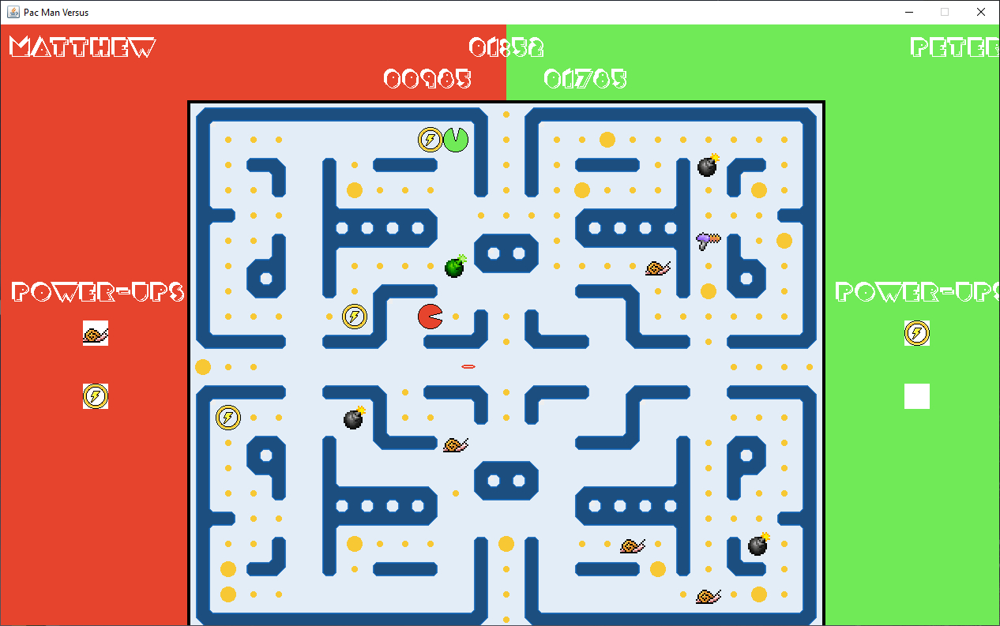

# Pac-Attack
Hello, welcome to our 1v1 Java-based deathmatch Pac Man game!

This project was created for the final in an ICS3U1 course, and was developed by Matthew Pechen-Berg and Peter Jang.

These are the project files for the Pac-Attack game. To play it, download the project and extract it to a folder of your choice, and then assuming you have Java and an IDE (we used DrJava) for it installed, open up "StartingFrame.java" with the IDE, and then compile "StartingFrame.java", and then run "StartingFrame.java".

After you run the compiled "StartingFrame.java" file, make sure to enter your names into the console for the game to begin playing.

Sorry if this does not work on different IDEs, we only developed and tested it for DrJava, as that is what the course required.
Some of the pixel art used in this project (except for items such as the ground tiles, and a few others), along with certain visual ideas or themes,
are not original ideas of us, and thus are not under our ownership, and we do not claim to have ownership over them. However, all of the code used
in this project was predominantly original in nature, with some aspects being potentially aided through the course material and from the minimal starting template that was mandatory to use.

Thank you very much for taking the time to check out our project! If you have fun playing it, please let us know!

Note: heavy commenting is due to school assignment criteria.
